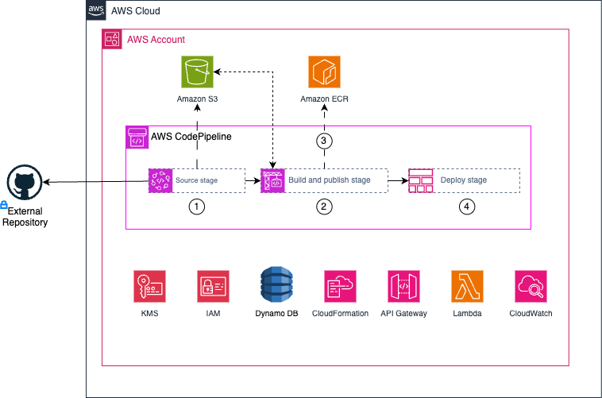

# Terraform AWS Certified DevOps Engineer Professional

The main purpose of this repository is to create resources that are mentioned within [AWS Certified DevOps Engineer - Professional](https://aws.amazon.com/certification/certified-devops-engineer-professional/) exam. The idea is to create an example architecture to showcase
provisioning, operating, and managing distributed application systems on AWS.

## Proposed architecture

Below is a high level overview detailing the services that will be created within this project, the necessary configuration will be done
in Terraform were possible. Or utilise other tools like [AWS CloudFormation](https://docs.aws.amazon.com/AWSCloudFormation/latest/UserGuide/Welcome.html), [Serverless](https://www.serverless.com/) to 
provision resources within your AWS account. To speed up deploying services [some of my existing repositories](https://github.com/kwame-mintah?tab=repositories&q=aws&type=&language=&sort=) will be re-used.



The diagram shows the following workflow:

1. In the source stage, AWS CodePipeline will use a AWS CodeConnections connection (*formerly known as AWS CodeStar Connections*) configured with an external git repository to download the source code.
2. Next in the build and publish stage, AWS CodeBuild will run unit tests found in the source code, using the specified [Buildspec](https://docs.aws.amazon.com/codebuild/latest/userguide/build-spec-ref.html) and report the coverage back to CodeBuild Report groups. Within this stage, it will also build a Docker image using the `Dockerfile` found in the repository.
3. The built Docker image will be pushed to AWS Elastic Container Registry (ECR) to be referenced later for deployment.
4. Finally a CloudFormation template will be used to deploy the necessary resources and reference docker images available in ECR to deploy various services.

## Development

### Dependencies

- [aws-vault](https://github.com/99designs/aws-vault)
- [terraform](https://www.terraform.io/)
- [terragrunt](https://terragrunt.gruntwork.io/)
- [terraform-docs](https://terraform-docs.io/) this is required for `terraform_docs` hooks
- [pre-commit](https://pre-commit.com/)

## Prerequisites

1. Have a [AWS account](https://aws.amazon.com/free) account and [associated credentials](https://docs.aws.amazon.com/general/latest/gr/aws-sec-cred-types.html).

## Information on HashiCorp BSL License Change

Due to the HashiCorp BSL license change, restricting Terraform to the latest open source version (`1.5.7`). 
Will create a new project template using OpenTofu. To learn more, see the official [OpenTofu website](https://opentofu.org/) 
and [project status](https://github.com/opentofu/opentofu/blob/main/WEEKLY_UPDATES.md).

## Usage

1. Navigate to the environment you would like to deploy,
2. Initialize the configuration with:
   ```bash
   aws-vault exec <profile> --no-session terragrunt init --backend-bootstrap
   ```
3. Plan your changes with:
   ```bash
   aws-vault exec <profile> --no-session terragrunt plan
   ``` 
4. If you're happy with the changes 
   ```bash
   aws-vault exec <profile> --no-session terragrunt apply
   ```

> [!NOTE]
>
> Please note that terragrunt will create an S3 Bucket and DynamoDB table for storing the remote state. 
> Ensure the account deploying the resources has the appropriate permissions to create or connect to these resources.

## Pre-Commit hooks

Git hook scripts are very helpful for identifying simple issues before pushing any changes. Hooks will run on every commit automatically pointing out issues in the code e.g. trailing whitespace.

To help with the maintenance of these hooks, [pre-commit](https://pre-commit.com/) is used, along with [pre-commit-hooks](https://pre-commit.com/#install).

Please following [these instructions](https://pre-commit.com/#install) to install `pre-commit` locally and ensure that you have run `pre-commit install` to install the hooks for this project.

Additionally, once installed, the hooks can be updated to the latest available version with `pre-commit autoupdate`.

## Documentation Generation

Code formatting and documentation for `variables` and `outputs` is generated using [pre-commit-terraform](https://github.com/antonbabenko/pre-commit-terraform/releases) hooks that in turn uses [terraform-docs](https://github.com/terraform-docs/terraform-docs) that will insert/update documentation. The following markers have been added to the `README.md`:
```
<!-- {BEGINNING|END}_TF_DOCS --->
```

<!-- BEGIN_TF_DOCS -->
## Requirements

| Name | Version |
|------|---------|
| <a name="requirement_terraform"></a> [terraform](#requirement\_terraform) | >= 1.0.0, <= 1.5.7 |
| <a name="requirement_aws"></a> [aws](#requirement\_aws) | ~> 5.95.0 |
| <a name="requirement_http"></a> [http](#requirement\_http) | ~> 3.5.0 |

## Providers

| Name | Version |
|------|---------|
| <a name="provider_aws"></a> [aws](#provider\_aws) | 5.95.0 |
| <a name="provider_http"></a> [http](#provider\_http) | 3.5.0 |

## Modules

| Name | Source | Version |
|------|--------|---------|
| <a name="module_aws_fastapi_lambda_api_gateway_ecr"></a> [aws\_fastapi\_lambda\_api\_gateway\_ecr](#module\_aws\_fastapi\_lambda\_api\_gateway\_ecr) | ./modules/ecr | n/a |
| <a name="module_codebuild_python_pytest"></a> [codebuild\_python\_pytest](#module\_codebuild\_python\_pytest) | ./modules/codebuild | n/a |
| <a name="module_codepipeline_artifact_store"></a> [codepipeline\_artifact\_store](#module\_codepipeline\_artifact\_store) | ./modules/s3 | n/a |
| <a name="module_codepipeline_iam_role"></a> [codepipeline\_iam\_role](#module\_codepipeline\_iam\_role) | ./modules/codepipeline-iam-role | n/a |

## Resources

| Name | Type |
|------|------|
| [aws_cloudformation_stack.dynamodb_table_stack](https://registry.terraform.io/providers/hashicorp/aws/latest/docs/resources/cloudformation_stack) | resource |
| [aws_codepipeline.cloudformation_template_codepipeline](https://registry.terraform.io/providers/hashicorp/aws/latest/docs/resources/codepipeline) | resource |
| [aws_codepipeline.python_codepipeline](https://registry.terraform.io/providers/hashicorp/aws/latest/docs/resources/codepipeline) | resource |
| [aws_codestarconnections_connection.github_kwame_mintah](https://registry.terraform.io/providers/hashicorp/aws/latest/docs/resources/codestarconnections_connection) | resource |
| [aws_iam_role.cloudformation_provider_role](https://registry.terraform.io/providers/hashicorp/aws/latest/docs/resources/iam_role) | resource |
| [aws_iam_role_policy.cloudformation_provider_policy](https://registry.terraform.io/providers/hashicorp/aws/latest/docs/resources/iam_role_policy) | resource |
| [aws_availability_zones.available_zones](https://registry.terraform.io/providers/hashicorp/aws/latest/docs/data-sources/availability_zones) | data source |
| [aws_caller_identity.current_caller_identity](https://registry.terraform.io/providers/hashicorp/aws/latest/docs/data-sources/caller_identity) | data source |
| [http_http.km_dynamodb_template](https://registry.terraform.io/providers/hashicorp/http/latest/docs/data-sources/http) | data source |

## Inputs

| Name | Description | Type | Default | Required |
|------|-------------|------|---------|:--------:|
| <a name="input_allowed_account_ids"></a> [allowed\_account\_ids](#input\_allowed\_account\_ids) | List of allowed AWS account IDs to prevent you<br>from mistakenly using an incorrect one. | `list(string)` | n/a | yes |
| <a name="input_aws_region"></a> [aws\_region](#input\_aws\_region) | The AWS region. | `string` | n/a | yes |
| <a name="input_env_prefix"></a> [env\_prefix](#input\_env\_prefix) | The prefix added to resources in the environment. | `string` | n/a | yes |
| <a name="input_project_name"></a> [project\_name](#input\_project\_name) | The name of the project. | `string` | n/a | yes |
| <a name="input_tags"></a> [tags](#input\_tags) | Tags to be added to resources created. | `map(string)` | `{}` | no |

## Outputs

| Name | Description |
|------|-------------|
| <a name="output_availability_zones"></a> [availability\_zones](#output\_availability\_zones) | List of the Availability Zone names available to the account. |
| <a name="output_current_caller_identity"></a> [current\_caller\_identity](#output\_current\_caller\_identity) | AWS Account ID number of the account that owns or contains the <br>calling entity. |
<!-- END_TF_DOCS -->
